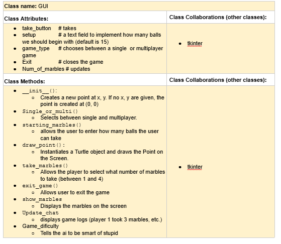
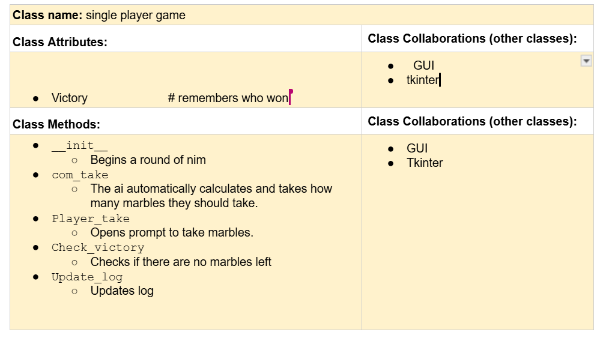
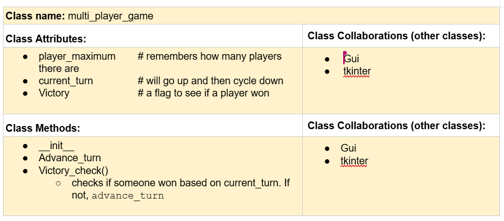

# CSC226 Final Project

## Instructions

️**Author(s)**: Preston, Mateo

️**Google Doc Link**: https://docs.google.com/document/d/18_jXzAVD610KmoF3pNYhY-C-fQ4JiSqebzeSFdFkPwI/edit?usp=sharing
---

## Milestone 1: Setup, Planning, Design


️**Title**: `Game of Nim: Reborn

**Purpose**: `Updated Version of the Game of Nim bringing into a more modern version 

️**Source Assignment(s)**: `Hw06: The Game of Nim`

️**CRC Card(s)**:
  - Create a CRC card for each class that your project will implement.
  - See this link for a sample CRC card and a template to use for your own cards (you will have to make a copy to edit):
    [CRC Card Example](https://docs.google.com/document/d/1JE_3Qmytk_JGztRqkPXWACJwciPH61VCx3idIlBCVFY/edit?usp=sharing)
  - Tables in markdown are not easy, so we suggest saving your CRC card as an image and including the image(s) in the 
    README. You can do this by saving an image in the repository and linking to it. See the sample CRC card below - 
    and REPLACE it with your own:







️**Branches**: This project will **require** effective use of git. 

Each partner should create a branch at the beginning of the project, and stay on this branch (or branches of their 
branch) as they work. When you need to bring each others branches together, do so by merging each other's branches 
into your own, following the process we've discussed in previous assignments, then re-branching out from the merged code.  

```
    Branch 1 starting name: Preston
    Branch 2 starting name: Mateo
```

### References 

Throughout this project, you will likely use outside resources. Reference all ideas which are not your own, 
and describe how you integrated the ideas or code into your program. This includes online sources, people who have 
helped you, AI tools you've used, and any other resources that are not solely your own contribution. Update this 
section as you go. DO NOT forget about it!

https://youtu.be/epDKamC-V-8?si=1bNJ4eY1hHNsV5Ux
https://youtu.be/eaxPK9VIkFM?si=GmSGtN2QnYjL17UJ
https://share.google/aimode/grbidWlJItPTIR9Ar
https://gemini.google.com/share/6e939ba0e3c7


---

## Milestone 2: Code Setup and Issue Queue
Most importantly, keep your issue queue up to date, and focus on your code. 🙃

Reflect on what you’ve done so far. How’s it going? Are you feeling behind/ahead? What are you worried about? 
What has surprised you so far? Describe your general feelings. Be honest with yourself; this section is for you, not me.

```
    i feel behind as been focused on other finals but now i feel like with the time 
    i have i can dedicate a majority of my time and be able to complete my parts in time
    - Preston
    
    
    -Mateo
    
    
```

---

## Milestone 3: Virtual Check-In

Indicate what percentage of the project you have left to complete and how confident you feel.
25%

**Completion Percentage**: `0 - 100%`
75%

**Confidence**: Describe how confident you feel about completing this project, and why. Then, describe some 
  strategies you can employ to increase the likelihood that you'll be successful in completing this project 
  before the deadline.

```
   i feel confident that we will complete on time i fell like we have a 100% change of completing it at this point
   -Preston Worrix
   
   
   -Mateo
```

---

## Milestone 4: Final Code, Presentation, Demo

### User Instructions

In a paragraph, explain how to use your program. Assume the user is starting just after they hit the "Run" button 
in PyCharm. 

at the start you can use the slider in the middle of the screen to select a number between 15 and 30 balls this will be the number of balls you play with
then you can use the check box to select between single and multiplayer
finnaly you can use the start game button to take you to the next screen the number of balls will be displayed in the middle of the screen
and the players turn at the top at the buttom you can choose to take 1 2 3 or 4 balls the goal of the game is to pick up the last ball
whoever does so will win.

### Errors and Constraints

Every program has bugs or features that had to be scrapped for time. These bugs should be tracked in the issue queue. 
You should already have a few items in here from the prior weeks. Create a new issue for any undocumented errors and 
deficiencies that remain in your code. Bugs found that aren't acknowledged in the queue will be penalized.

### Reflection

Each partner should write three to four well-written paragraphs address the following (at a minimum):
- Why did you select the project that you did?
- How closely did your final project reflect your initial design?
- What did you learn from this process?
- What was the hardest part of the final project?
- What would you do differently next time, knowing what you know now?
- How well did you work with your partner? What made it go well? What made it challenging?


```
       I propsed the idea of the game of nim becouse i beileive it was one of ther funniest projects
we had to code during this semester and beileived it would be easy to expand on. though the 
finaly project didn't meet my initial designs i had imigined i beileive we did a good job 
and got alot done.
    i learned from this project, its very important to leave enough time to be able to implement every
you imigined, as some of the aspects may be harder to implement than you orignanly thought such
as the switching screen for this project as i beileive this was the hardest part of the code for me
i still dont have a full grasp on how it works same with layout i stuggled with it alot but eventually 
figured my way around it.
    i beileive i would start sooner and do more reasearch into tkinter to learn more how it works
i beileive this would allow me to do better in the design and codeing. i beileive me and my didnt work the best
- together. - Preston Worrix
```

```
    Partner 2: **Replace this with your reflection
```

---